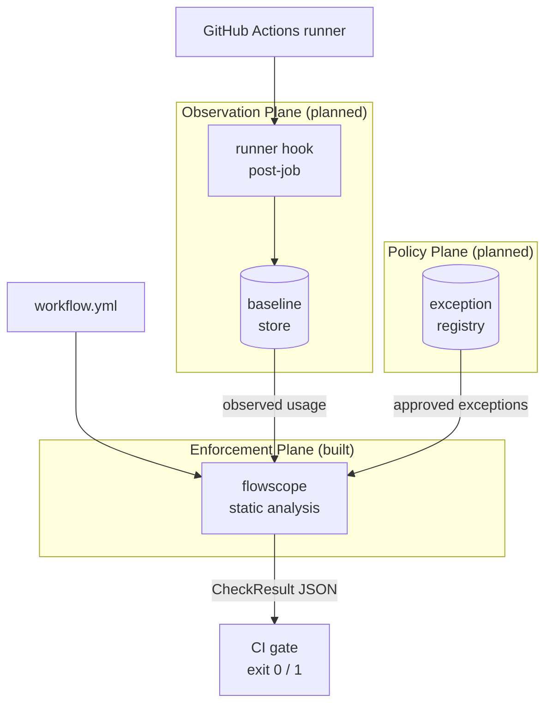
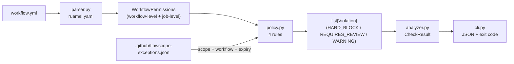
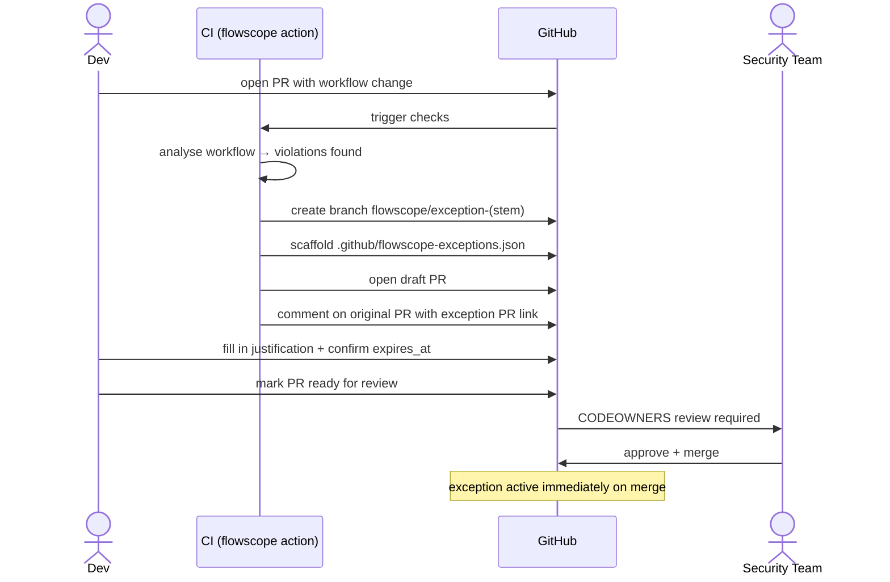

# Flowscope — Architecture

## Problem Statement

GitHub Actions workflows run with a `GITHUB_TOKEN` scoped at the workflow or job level. Misconfigured permissions — `permissions: write-all` etc, implicit full access from an empty `permissions: {}` block, or workflow-level write scopes that bleed into unscoped jobs — create unnecessary blast radius on every CI run. Developers declare more than required to get past immediate issues, and permissions are never examined again. Agentic steps (AI coding agents making API calls under the job token) amplify the risk further: a write-scoped token in an agentic job can be exploited or misused in ways that pure automation cannot.

The goal: enable least-privilege permissions as a structural gate in CI. Create a framework for auditing existing workflow permissions.

---

## System Overview — Three-Plane Architecture

Flowscope is one component of a three-plane governance system. Only the enforcement plane is built; the other two are designed and ready to wire in.



**Enforcement Plane (built):** Static analysis gate running in CI. Inspects workflow YAML before merge. Classifies violations by tier and emits structured JSON with an exit code. Accepts an observed baseline and an exception registry as optional inputs.

**Observation Plane (planned):** Post-job runner hooks that record which token scopes were actually exercised at runtime. Output is a baseline JSON file fed back into the enforcement plane — enabling the policy engine to distinguish "this job requests write scope and uses it" from "this job requests write scope but never touches it."

**Policy Plane (planned):** Centralized baseline store and exception registry with audit trail. Aggregates data across repos; feeds the enforcement plane with historical usage signals and security-team-approved exceptions.

---

## Enforcement Plane — Internal Data Flow



**Two-level permission model:** GitHub Actions tokens operate at two levels — a workflow-level `permissions` block sets the default for all jobs; a job-level `permissions` block overrides it for that job only. `WorkflowPermissions` mirrors this: it holds a workflow-level scope map plus a `jobs` dict of `JobPermissions`. The special cases `write-all` and implicit full access (empty `permissions: {}`) are flags rather than scope entries because they collapse all scope detail — there is nothing meaningful to say about individual scopes when either flag is set.

**`parser.py`** loads YAML with `ruamel.yaml` (comment-preserving, for future advisory rules that inspect inline justification comments) and populates the model. Only jobs with an explicit non-empty `permissions` block get a `JobPermissions` entry; all others are treated as unscoped.

**`policy.py`** evaluates four rules in order and returns a flat `list[Violation]`. Each violation carries a tier, the affected scope, file path, line number, and a remediation hint.

**`analyzer.py`** is the thin coordinator: loads YAML once, passes the raw document to both parser and policy evaluator, assembles `CheckResult`. The `passed` field is `False` if any `HARD_BLOCK` or `REQUIRES_REVIEW` violation is present.

**`cli.py`** serializes `CheckResult` to JSON on stdout and exits with code 0 (pass) or 1 (fail). The GitHub Action captures this output before propagating the exit code so `$GITHUB_OUTPUT` is always written even when violations are found.

---

## Policy Rules

The four rules are evaluated in order. Rules 1 and 2 return immediately — there is nothing meaningful to say about job-level scoping when the workflow is already maximally permissioned.

| Rule | Condition | Tier | Notes |
|------|-----------|------|-------|
| 1 | `permissions: write-all` | `HARD_BLOCK` | Returns immediately |
| 2 | `permissions: {}` (implicit full access) | `HARD_BLOCK` | Equivalent to write-all on GHA; returns immediately |
| 3 | Workflow-level write scope + any unscoped job | `HARD_BLOCK` | Job-level override required for each job |
| 4 | Agentic action + write scope + no observed baseline | `REQUIRES_REVIEW` | Registry-driven; new actions added to `AGENTIC_ACTIONS` in `policy.py` |

**Violation tiers:**
- `HARD_BLOCK` — fails the check; resolved by fixing the workflow or registering a formal exception
- `REQUIRES_REVIEW` — fails the check; resolved by human sign-off (no code change required)
- `WARNING` — defined, not yet emitted; does not fail the check
- `ADVISORY` — planned; write scopes with no inline justification comment

**Exception suppression:** `evaluate_policy` accepts a list of exceptions from `.github/flowscope-exceptions.json`. An exception is active if it is not expired (`expires_at` is a future ISO date). Exceptions are scoped to a `(scope, workflow_path)` pair — a single approved exception does not silently suppress violations in other workflows. Repo-wide grants are supported by omitting the `workflow` field. CODEOWNERS enforces that the security team reviews any change to the exceptions file.

---

## Exception Approval Workflow

When `create-exception-pr: true` is set on the action and violations are found, flowscope creates a draft PR scaffolding the exception entry — removing the friction of the approval path.



The branch name `flowscope/exception-<stem>` is deterministic: if the developer pushes again before the exception PR is merged, the action detects the branch already exists and posts the existing PR link rather than creating a duplicate.

The scaffolded entry:
```json
{
  "scope": "contents",
  "justification": "TODO: describe why this exception is needed",
  "approved_by": "",
  "expires_at": "2026-08-24",
  "workflow": ".github/workflows/build.yml",
  "job_id": "deploy"
}
```

No `status` field. CODEOWNERS-gated merge is the approval gate; expiry handles time-bounding. A `status: pending` field would require a second commit to activate the exception after merge — manual toil with no security benefit.

---

## Design Decisions

**Per-repo exceptions vs. central store.** Per-repo storage keeps governance next to the code it governs, makes CODEOWNERS straightforward, and gives developers a local audit trail in git history. Central aggregation across repos is addable later by reading the same JSON schema from a store — the schema does not need to change.

**Exception scoped to `(scope, workflow)`.** A repo-wide exception for `contents: write` approved for one workflow should not silently cover a new workflow added six months later. The `workflow` field makes intent explicit. Omitting it opts into a repo-wide grant, which is a deliberate choice rather than an accidental default.

**Deterministic branch names.** `flowscope/exception-<stem>` reduces idempotency to a branch-existence check (`git ls-remote --exit-code`). No PR search, no state file, no race condition.

**`REQUIRES_REVIEW` tier.** Agentic actions with write scope cannot be statically proven safe — the question is whether the action's behavior under that token is acceptable, which requires human judgment. A `HARD_BLOCK` would demand a code fix that may not exist; a `WARNING` would let it pass silently. `REQUIRES_REVIEW` names the right gate: human sign-off.

**`ruamel.yaml` over PyYAML.** Comment-preserving parse tree retained for planned advisory rules: write scopes with no inline justification comment will emit an `ADVISORY` violation. PyYAML discards comments; switching later would require re-parsing all documents.

**Rules 1 and 2 return early.** When `write-all` or implicit full access is set, reporting job-level violations would be misleading — there are no job-level scopes to fix. Early return keeps the output focused on actionable items.

---

## What's Next

The enforcement plane is production-ready as a standalone CI gate. The two planned planes connect to it via inputs already wired into the CLI:

**Existing workflow coverage — the blind spot today.** The CI gate only fires when a workflow file changes. Workflows that predate flowscope adoption, or that were approved before a rule was added, run indefinitely without review. The observation plane is the fix: because it records actual token usage at runtime, it generates baseline data for every workflow that runs — not just those being modified. That baseline can be periodically compared against declared scopes in a scheduled scan (flowscope already accepts a file path, not just a PR context), surfacing overprovisioning that has been sitting in the repo for months.

**Observation plane:** A post-job runner hook records which API endpoints the `GITHUB_TOKEN` called during the job. Output is a `baseline.json` passed to `flowscope --baseline`. This unlocks Rule 4 for any agentic action — not just those in the registry — and enables future rules that downgrade violations when observed usage is narrower than declared scope.

**Policy plane:** A baseline store aggregates observed usage across repos. An exception registry with audit trail replaces the per-repo JSON files for organizations that want centralized governance. Both feed the enforcement plane through the same `--baseline` and `--exceptions` interfaces.

**Advisory tier:** Write scopes with no inline comment on the `permissions` block will emit `ADVISORY` violations — surfacing in annotations without blocking the build. This requires the comment-preserving parse tree that `ruamel.yaml` already provides.

**`WARNING` tier:** Defined in `ViolationTier`, not yet emitted by any rule. Candidate use: write scopes that appear in the baseline but are broader than what was observed.
