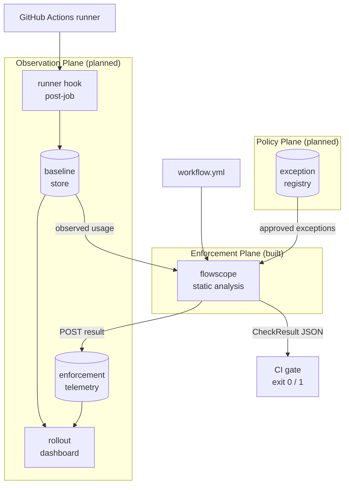
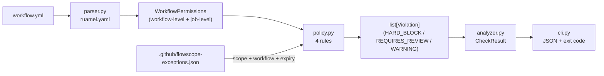
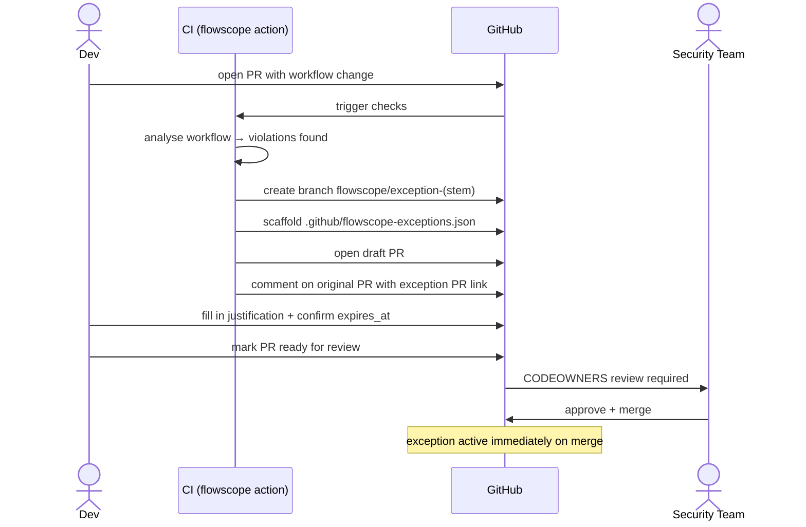

# Flowscope — Architecture

## Problem Statement

GitHub Actions workflows run with a `GITHUB_TOKEN` scoped at the workflow or job level. Misconfigured permissions — `permissions: write-all` etc, implicit full access from an empty `permissions: {}` block, or workflow-level write scopes that bleed into unscoped jobs — create unnecessary blast radius on every CI run. Developers declare more than required to get past immediate issues, and permissions are never examined again. Agentic steps (AI coding agents making API calls under the job token) amplify the risk further: a write-scoped token in an agentic job can be exploited or misused in ways that pure automation cannot.

The goal: enable least-privilege permissions as a structural gate in CI. Create a framework for auditing existing workflow permissions. With full implementation, leverage flywheel effect to build database of baseline permission usage and acceptable risk, so the system becomes self-improving.

---

## Deployment Assumptions

Flowscope is designed around three platform-level controls that must be in place for the system to be effective. These are not optional enhancements — they are the environment the enforcement plane assumes.

**Self-hosted runners.** GitHub-hosted runners are opaque: you get workflow-level logs but no visibility into what the `GITHUB_TOKEN` actually called at the network layer. Self-hosted runners are the preferred execution environment because egress and ingress are controllable — API traffic can be routed through a proxy or firewall, making token usage observable. Runner-level telemetry feeds a SIEM. The observation plane's post-job hooks, which record actual scope usage to build baselines, require a runner the org controls.

**Org-mandated required workflows.** Flowscope is deployed as a GitHub [required workflow](https://docs.github.com/en/actions/sharing-automations/required-workflows) at the org level, scoped to `.github/workflows/**` path changes. Coverage is automatic across every repo in the org — no per-repo opt-in, and no way for a developer to remove the gate from their own repo. The check fires on every PR that touches a workflow file, before merge.

**Org-level CODEOWNERS controlling the workflow surface.** An entry in the org's central `.github` repo routes changes to the right reviewers and provides the human audit layer on top of static analysis. The specific paths under CODEOWNERS control are:

| Path | Reviewer | Why |
|------|----------|-----|
| `.github/CODEOWNERS` | platform + security | Routing itself must not be self-modifiable |
| `.github/workflows/**` | platform team | General audit on every workflow change |
| `.github/actions/**`, `action.yml`, `action.yaml` | platform team | Composite/local actions execute in the same trust context as workflows |
| `.github/flowscope-exceptions.json` | security team | Permission exceptions are explicit security-team decisions |

Routing is risk-tiered through pattern specificity. The general `.github/workflows/**` line covers any workflow change; more specific patterns override it for higher-risk categories. This can be combined with automated review tooling to scale security team attention to where it matters most.

---

## System Overview — Three-Plane Architecture

Flowscope is one component of a three-plane governance system. Only the enforcement plane is built; the other two are designed and ready to wire in.



**Enforcement Plane (built):** Static analysis gate running in CI. Inspects workflow YAML before merge. Classifies violations by tier and emits structured JSON with an exit code. Accepts an observed baseline and an exception registry as optional inputs.

**Observation Plane (planned):** Two data flows feeding a central store and rollout dashboard.

*Runtime token observation.* Post-job runner hooks record which token scopes the `GITHUB_TOKEN` actually exercised at runtime. Output is baseline JSON the enforcement plane consumes to distinguish "this job declares write scope and uses it" from "this job declares write scope but never touches it." Required for Rule 4 to clear without manual review and for the WARNING tier (declared exceeds observed) to start emitting.

*Enforcement telemetry.* Each flowscope run POSTs its check result to a central endpoint (`FLOWSCOPE_REGISTRY_URL`, already wired into the CLI and action). The receiving service aggregates results into a rollout dashboard answering operational questions:

- **Coverage.** Which repos have been scanned, when, by which flowscope version. Surfaces gaps: "12 repos in the org have never been scanned"; "47 repos haven't been scanned in 30 days." Without this, the org doesn't know how complete its own enforcement footprint is.
- **Would-block under enforcement.** For repos running in `--warn-only` mode: count of would-be-blocked findings by tier and by rule, by repo and by team. Answers the rollout question "if I flip the switch from warn-only to blocking today, how many repos break and which teams own them?"
- **Trends over time.** Violation counts per tier per week as enforcement ramps; exception registrations vs. expirations; mean time to resolution for blocking findings. Demonstrates whether the program is reducing risk or just generating noise.
- **Per-team rollup.** Aggregated by the CODEOWNERS routing already configured on workflow files — security team sees what's routed to security, platform sees platform. The same routing that gates merge gates the dashboard view.

This is what makes the gradual `--warn-only` rollout deliberate rather than indefinite. Without the dashboard, audit mode is just "don't fail anyone yet" and there's no measure of when it's safe to enforce. With it, the transition is a measurable, time-boxed program.

**Policy Plane (planned):** Centralized baseline store and exception registry with audit trail. Aggregates data across repos; feeds the enforcement plane with historical usage signals and security-team-approved exceptions.

---

## Enforcement Plane — Internal Data Flow



**Two-level permission model:** GitHub Actions tokens operate at two levels — a workflow-level `permissions` block sets the default for all jobs; a job-level `permissions` block overrides it for that job only. `WorkflowPermissions` mirrors this: it holds a workflow-level scope map plus a `jobs` dict of `JobPermissions`. The special cases `write-all` and implicit full access (empty `permissions: {}`) are flags rather than scope entries because they collapse all scope detail — there is nothing meaningful to say about individual scopes when either flag is set.

**`parser.py`** loads YAML with `ruamel.yaml` (comment-preserving, for future advisory rules that inspect inline justification comments) and populates the model. Only jobs with an explicit non-empty `permissions` block get a `JobPermissions` entry; all others are treated as unscoped.

**`policy.py`** evaluates four rules in order and returns a flat `list[Violation]`. Each violation carries a tier, the affected scope, file path, line number, and a remediation hint.

**`analyzer.py`** is the thin coordinator: loads YAML once, passes the raw document to both parser and policy evaluator, assembles `CheckResult`. The `passed` field is `False` if any `HARD_BLOCK` or `REQUIRES_REVIEW` violation is present. The two blocking tiers share a resolution mechanism (fix or exception) but differ in communication — the distinction guides the reviewer rather than gating differently.

**`cli.py`** serializes `CheckResult` to JSON on stdout and exits with code 0 (pass) or 1 (fail). The GitHub Action captures this output before propagating the exit code so `$GITHUB_OUTPUT` is always written even when violations are found.

---

## Policy Rules

The four rules are evaluated in order. Rules 1 and 2 return immediately — there is nothing meaningful to say about job-level scoping when the workflow is already maximally permissioned.

| Rule | Condition | Tier | Notes |
|------|-----------|------|-------|
| 1 | `permissions: write-all` | `HARD_BLOCK` | Returns immediately |
| 2 | `permissions: {}` (implicit full access) | `HARD_BLOCK` | Equivalent to write-all on GHA; returns immediately |
| 3 | Workflow-level write scope + any unscoped job | `HARD_BLOCK` | Job-level override required for each job |
| 4 | Agentic action + write scope + no observed baseline | `REQUIRES_REVIEW` | Blocks; cleared by exception (auto-scaffolded) or fix |
| 5 | `pull_request_target` trigger + any write scope | `HARD_BLOCK` | Canonical fork-PR-poisoning attack vector |
| 6 | `workflow_run` trigger + any write scope | `REQUIRES_REVIEW` | Blocks; chain inherits implicit secrets access |
| 7 | High-risk scope write (`actions`, `id-token`, `packages`, `attestations`) without inline justification | `ADVISORY` | Suppressed by `# flowscope:reason: <why>` on the scope line |

**Violation tiers:**
- `HARD_BLOCK` — fails the check; resolved by fixing the workflow or registering a formal exception
- `REQUIRES_REVIEW` — fails the check. Shares the resolution mechanism with `HARD_BLOCK` (fix or exception, scaffolded by the auto-PR feature) but the messaging frames a judgment call rather than a clear misconfiguration. The reviewer decides whether the pattern (e.g. an agentic action with write scope) is acceptable; if yes, an exception entry records the decision.
- `WARNING` — defined, not yet emitted by any rule; reserved for observation-plane outputs (e.g. declared scope exceeds observed usage)
- `ADVISORY` — non-blocking soft signal. Currently emitted by Rule 7 for high-risk scopes without an inline justification comment

**Exception suppression:** `evaluate_policy` accepts a list of exceptions from `.github/flowscope-exceptions.json`. An exception is active if it is not expired (`expires_at` is a future ISO date). Exceptions are scoped to a `(scope, workflow_path)` pair — a single approved exception does not silently suppress violations in other workflows. Repo-wide grants are supported by omitting the `workflow` field. CODEOWNERS enforces that the security team reviews any change to the exceptions file.

---

## Exception Approval Workflow

When `create-exception-pr: true` is set on the action and violations are found, flowscope creates a draft PR scaffolding the exception entry — removing the friction of the approval path.



The branch name `flowscope/exception-<stem>` is deterministic: if the developer pushes again before the exception PR is merged, the action detects the branch already exists and posts the existing PR link rather than creating a duplicate.

The scaffolded entry:
```json
{
  "scope": "contents",
  "justification": "TODO: describe why this exception is needed",
  "expires_at": "2026-08-24",
  "workflow": ".github/workflows/build.yml",
  "job_id": "deploy"
}
```

No `status` field. No `approved_by` field. CODEOWNERS-gated merge is the approval gate; expiry handles time-bounding. Either field would require a second commit at review time — `status: pending → active` to activate the exception, or `approved_by: ""` to be filled in by the reviewer — adding manual toil that duplicates what the git merge record already proves under CODEOWNERS routing.

---

## Design Decisions

**Per-repo exceptions vs. central store.** Per-repo storage keeps governance next to the code it governs, makes CODEOWNERS straightforward, and gives developers a local audit trail in git history. Central aggregation across repos is addable later by reading the same JSON schema from a store — the schema does not need to change.

**Exception scoped to `(scope, workflow)`.** A repo-wide exception for `contents: write` approved for one workflow should not silently cover a new workflow added six months later. The `workflow` field makes intent explicit. Omitting it opts into a repo-wide grant, which is a deliberate choice rather than an accidental default.

**Deterministic branch names.** `flowscope/exception-<stem>` reduces idempotency to a branch-existence check (`git ls-remote --exit-code`). No PR search, no state file, no race condition.

**No `status` or `approved_by` fields in the exception schema.** Both would require a second commit at review time — `status: pending → active` to activate the exception, or `approved_by` to be filled by the reviewer. The PR merge under CODEOWNERS gating is the authoritative approval record: who merged it, when, and with whose review is all in the git history. A field on the JSON entry is at best a duplicate and at worst a second source of truth that drifts.

**`REQUIRES_REVIEW` tier — blocking, semantically distinct.** Agentic actions with write scope cannot be statically proven safe — the question is whether the action's behavior under that token is acceptable, which requires human judgment. The tier blocks the check (same exit semantics as `HARD_BLOCK`) but uses different messaging and remediation framing: the reviewer is being asked to make a judgment call, not fix a clear misconfiguration. An earlier design treated `REQUIRES_REVIEW` as non-blocking on the theory that the CODEOWNERS-routed PR approval was the gate; that was reconsidered because it relies on CODEOWNERS being perfectly configured (pattern coverage matching every agentic action file, branch protection requiring CODEOWNERS approval, no admin bypass). Most orgs have imperfect CODEOWNERS coverage, so blocking is the safer default. The shared resolution mechanism with `HARD_BLOCK` (fix or exception, scaffolded by `create_exception_pr: true`) means there's no friction cost — the exception PR's CODEOWNERS-gated merge IS the recorded acknowledgment.

**`ruamel.yaml` over PyYAML.** Comment-preserving parse tree retained for advisory rules: Rule 7 looks for inline `# flowscope:reason:` markers on high-risk scope lines, and a future advisory rule for generic write scopes can follow the same pattern. PyYAML discards comments; switching later would require re-parsing all documents.

**Rules 1 and 2 return early.** When `write-all` or implicit full access is set, reporting job-level violations would be misleading — there are no job-level scopes to fix. Early return keeps the output focused on actionable items.

---

## Rollout: Warn-Only to Enforcement

`--warn-only` and the observation plane are designed to work together as a deliberate transition program from no enforcement to full enforcement:

1. **Deploy warn-only org-wide.** flowscope wired as a required workflow with `warn_only: "true"` and `registry_url` pointed at the observation plane endpoint. Every PR is scanned, no PR is blocked. Coverage starts immediately across every repo.

2. **Let telemetry populate.** As PRs land, the registry receives results. Within a few weeks of normal PR activity, the dashboard has a representative picture: which repos have coverage, which rules trigger most often, which teams own the would-blockers.

3. **Triage the would-block backlog before flipping any switch.** Walk the dashboard: real misconfigurations get fixed via normal PRs; legitimate patterns get exceptions registered (auto-PR scaffolded); over-broad rules get refined. The backlog shrinks while warn-only stays in place — no one is blocked, but the path to enforcement is being cleared.

4. **Enforce in waves.** Flip blocking on for low-risk repo groups first — internal tooling, scratch repos, low blast radius. The remaining warn-only fleet still produces dashboard data for comparison. If the enforced groups' findings trend down without surprise breakage, expand the boundary.

5. **Make blocking the org default.** Once high-volume repos enforce cleanly, set blocking as the org-wide default. Warn-only becomes the opt-in for newly-acquired repos or repos under active remediation — not the standard posture.

Without telemetry, the warn-only → blocking transition is a leap of faith taken on someone's gut feel. With it, every phase has measurable exit criteria: would-block count below threshold, exception backlog drained, no rule firing more than expected. That's the difference between a security program with deadlines and a security program with deferrals.

---

## What's Next

The enforcement plane is production-ready as a standalone CI gate. The two planned planes connect to it via inputs already wired into the CLI:

**Existing workflow coverage — the blind spot today.** The CI gate only fires when a workflow file changes. Workflows that predate flowscope adoption, or that were approved before a rule was added, run indefinitely without review. The observation plane is the fix: because it records actual token usage at runtime, it generates baseline data for every workflow that runs — not just those being modified. That baseline can be periodically compared against declared scopes in a scheduled scan (flowscope already accepts a file path, not just a PR context), surfacing overprovisioning that has been sitting in the repo for months.

**Observation plane:** Two integrations feeding a central store and dashboard:

1. *Runtime token observation* — post-job runner hook records which API endpoints the `GITHUB_TOKEN` called during the job. Output is `baseline.json` passed to `flowscope --baseline`. Unlocks Rule 4 for any agentic action (not just those in the registry) and enables the WARNING tier (declared scope exceeds observed usage). As actions are observed, permissions usage is tracked and can inform `flowscope` decisions, which allows replacing static rules with empirical usage patterns — over-permissioning caught with data, not just static intuition.
2. *Enforcement telemetry* — `FLOWSCOPE_REGISTRY_URL` (already wired into the CLI and action) POSTs each check result to a central endpoint. The receiving service aggregates into a rollout dashboard: coverage (which repos scanned and when), would-block counts under audit mode, exception lifecycle, trend lines. Makes `--warn-only` rollout measurable: the security team can answer "if we flip enforcement on today, what breaks?" before doing it.

**Policy plane:** A baseline store aggregates observed usage across repos and known actions. An exception registry with audit trail replaces the per-repo JSON files for organizations that want centralized governance. Both feed the enforcement plane through the same `--baseline` and `--exceptions` interfaces.

**`WARNING` tier:** Defined in `ViolationTier`, not yet emitted by any rule. Candidate use: declared write scopes that the observation plane has never seen exercised at runtime — broader than what's actually used.
